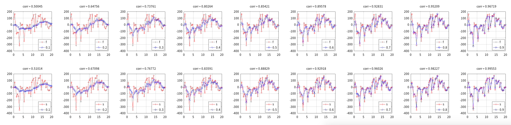
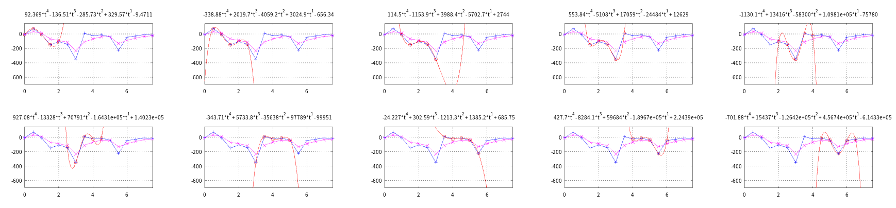
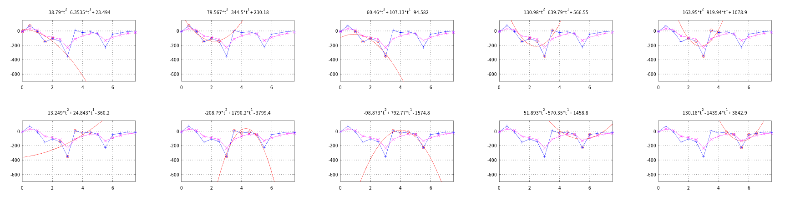

# run
```
>> gen_lpf_sample
>> cmp_interpolation
>> cmp_polyfit
```

# example plot image

* low pass filter example 
  - 
* low pass filter vs interpolation 
  - 
* low pass filter vs polynomial fitting 
  - 
